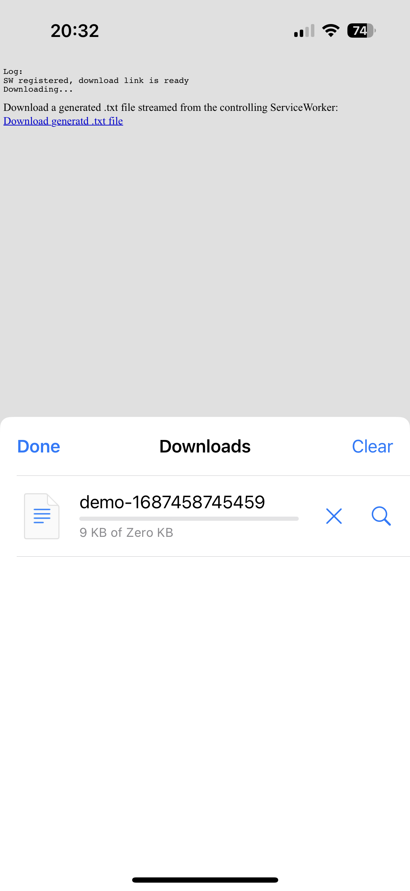
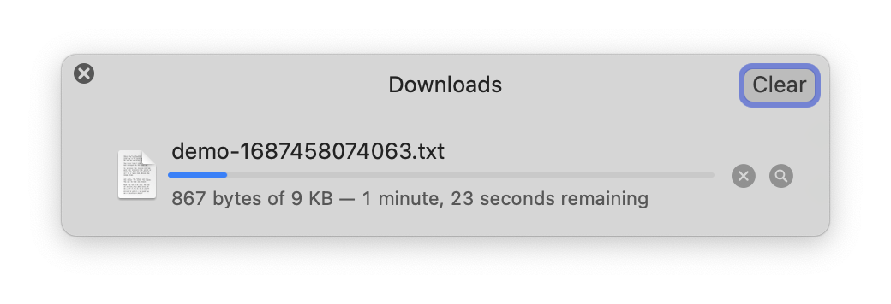

Streaming downloads through a ServiceWorker work perfectly on macOS, but on iOS are shown as 0kb and do not report progress correctly in the download manager.

Run this project:

```sh
$ npx serve
$ open 'http://localhost:3000'
```

Click the download link to download a .txt file created and streamed entirely from the registered ServiceWorker. The download is artificially slow to make it easier to see the progress in the download manager.

## Expected outcome

The download manager reads the `Content-length` header and reports that as the file size, then shows the % progress correctly as the file is streamed.

## Actual outcome

On iOS, the file size is reported as 0kb and the progress is shown as indeterminate until the download completes. The downloaded file is usable, so this is a cosmetic bug in the download manager. We have seen bug reports for our app where people mistook this cosmetic bug as a download failure.



On macOS the download manager does the right thing.


